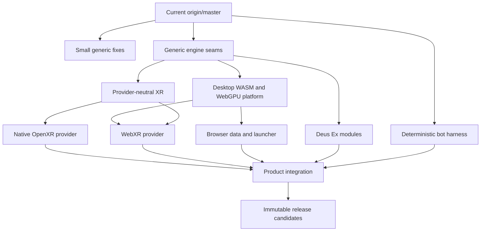

# Integration branch map for production candidate `71650dd7`

Date: 2026-07-23

This document maps the frozen production candidate at
`71650dd7e80411532cc2baaca6623ad9404b25a9` into independently maintainable
topics relative to the inspected `origin/master` at
`c2599d51ecde93b2308f8165de33e9296feca685`. It is an extraction plan, not a
proposal to merge the release branch upstream.

The current documentation/test integration head is
`32a2948684b2166a269ba0aeaf2425cb9d03c406`. It is five commits after the
production candidate and changes only four documentation files plus
`Tests/ExpressionEvaluatorTests.cpp`. It does not replace `71650dd7` as the
native or WebXR artifact/source identity.

## Frozen artifact boundary

- Native package:
  `C:\Devstuff\QuestGames\release-candidates\SurrealEngine-Native-OpenXR-71650dd7-headless-rc.zip`
  with SHA-256
  `42d64b2660ef7c7dc208979ee1199a0b0b645a950a432ebc1d97aaa5cde6cf56`;
  its bundled tracked-source archive is
  `2533a389bfa8baa046960fa6ab03c88d3052856c6a22f2052a28c7d0f67dacdf`.
- WebXR package:
  `C:\Devstuff\QuestGames\release-candidates\SurrealEngine-WebXR-71650dd7`.
  Its frozen hashes are:
  `engine/SurrealEngine.js`
  `22dd5ec417ea5debdb0d9d9a8bd5b0bd5d6d2f759e81c22ae5b1ddba4ce128dd`,
  `engine/SurrealEngine.wasm`
  `1ca34875dbfbd822904195ea90bceb2727a91552c210d563c3a5ede7c04acb77`,
  corresponding source
  `25c47c542c26943adb7b01e928f25f2987959fd4c2ddc728c6761a79f27af101`,
  and `release-manifest.json`
  `0c5bd9a59e086fc6d69babfc7763ca17acd155013714c5f0e4d4dc9cecaf8fb1`.
- Later documentation or test commits can improve evidence and instructions,
  but cannot silently change the qualified artifact identity. Any executable,
  engine JS/WASM, source bundle, or release-manifest change requires a new
  candidate commit and new hashes.

## Comparison result

- The common ancestor is `891082d9f05a0f7b9ffcb4f65c9653f36fce5613`.
- `origin/master` is 3 commits ahead of that ancestor; production candidate
  `71650dd7` is 240 commits ahead.
- The production-candidate delta is 343 files, 45,249 insertions, and 1,074
  deletions.
- Upstream changed seven files after the common ancestor. Only
  `SurrealEngine/UObject/UActor.cpp` is also changed by the release candidate.
- A Git merge-tree check found no textual conflict between complete production
  head `71650dd7` and the inspected `origin/master`. The same check was clean
  for all 32 local `pr/*` tips.
- Clean textual merges do not make the 240-commit integration history suitable
  for review. The size, mixed policy, and cross-platform coupling still require
  reconstruction as the layers below.

The first detailed audit was captured one commit earlier at `55433b37`. Its
snapshot was 239 release-side commits and 45,239 insertions across the same 343
files. Production commit `71650dd7` adds only the packaging regression change
in `web/smoke_test_release_package.py`, producing the exact 240-commit/45,249
count above without changing the dependency map.

The three newer upstream commits are the `GCRootNode` list correction,
experimental `BlendAnim` support, and `UBorderWindow`. `BlendAnim` is why
`UActor.cpp` needs special human review when replaying the actor-movement fix or
any XR weapon hook. The current merge is clean, but semantic compatibility must
still be checked.

## Dependency shape

Each arrow means “may consume,” not “merge the parent history into every
branch.” A topic branch is based on its smallest declared dependency. Once that
dependency lands upstream, the child is replayed on the new upstream tip.

## Layer 1: small generic engine fixes

These are the best first upstream candidates because each can stand alone and
does not require XR, WebAssembly, Deus Ex architecture, or bot infrastructure.

| Topic | Source evidence | Owned files | Dependency and disposition |
| --- | --- | --- | --- |
| Accessed-none array evaluation | `bdd4ac66`; reconstructed tip `pr/accessed-none-array` at `e62a9ab5` | `SurrealEngine/VM/ExpressionEvaluator.cpp`, `Tests/ExpressionEvaluatorTests.cpp`, narrow test registration | Already based on inspected `origin/master`; smallest current candidate. |
| Cardinal-axis actor movement | `ad58cd6e`; reconstructed tip `pr/deus-ex-runtime-fix` at `aada7f2a` | `SurrealEngine/UObject/ActorMovement.h`, narrow `UActor.cpp` call-site change, `Tests/ActorMovementTests.cpp` | Replay on current upstream and inspect the `BlendAnim`-adjacent `UActor.cpp` result. Present as a generic movement correction, not a Deus Ex refactor. |
| Aggregate boolean serialization | `f1591d05`; reconstructed tip `pr/property-serialization` at `1965a397` | `UProperty.cpp/.h`, `Tests/PropertySerializationTests.cpp` | Independent of every platform and game. |
| OpenAL gain update | `3ac1162c` | `AudioDevice.cpp`, `AudioGainPolicy.h`, focused audio tests | Extract as a separate generic audio correction only if reproduced on current upstream. |
| Legacy reflection layouts | `ffd9fdaa` (`Parent`) and `874abaa5` (`DynamicString`) | `UObjectVersion.*`, `PropertyOffsets.cpp`, `UObject.cpp`, `UProperty.cpp` | Two separate compatibility fixes. Require a lawful minimal reproduction; do not combine them with demo importing. |

Do not include integration documentation, launcher behavior, XR call hooks, or
browser build changes in these fixes.

## Layer 2: generic engine seams

These make the product modular, but they are architecture changes and should be
offered only after the small-fix path establishes review confidence.

| Ordered topic | Preserved topic tip | Primary scope | Smallest dependency |
| --- | --- | --- | --- |
| Frame phases | `pr/frame-pipeline` `5dbcf833` | `Engine.*`, `GameApp.cpp`, `GameWindow.cpp`, `MainGame.cpp` | current upstream |
| View family | `pr/view-family` `c0e81509` | `Render/ViewFamily.*`, narrow render/engine call sites | frame phases |
| Presentation layers | `pr/presentation-layers` `9d96e62f` | `Render/Presentation.h`, `RenderSubsystem.*`, `RenderScene.cpp`, `VisibleFrame.*` | view family |
| Opaque target binding | `pr/presentation-target-binding` `398dbfd8` | presentation target identifiers and render-device binding | presentation layers |
| Input composition | `pr/input-composition` `d5fa59ca` | `Input/InputComposition.*`, narrow `Engine` input wiring | current upstream |
| VM call-hook registry | `pr/vm-hook-registry` `5d123dac` | `VM/CallHooks.*`, `Frame.*`, focused hook tests | current upstream |
| Game-support registry | `pr/game-support-registry` `2ccdb1d8` | `GameSupport.*`, `GameFolder.*`, typed game database wiring | current upstream |

The frame/view/presentation chain must land in that order. Input composition,
VM hooks, and the game-support registry are independent siblings and should not
be bundled with it. Provider names and handles must not appear in these APIs.

The existing branches are three upstream commits behind except for
`pr/accessed-none-array`. Merge-tree says they compose cleanly today, but each
must be replayed or rebased onto the current upstream base and reviewed line by
line before use as a PR source.

## Layer 3: desktop WebAssembly and browser platform

WebAssembly remains a desktop platform target. It must build and run without
WebXR.

| Ordered topic | Source/topic | Scope | Dependency |
| --- | --- | --- | --- |
| Emscripten and WebGPU foundation | `85ea48f7`, `53dc75f8`; `pr/web-platform-foundation` `88980d62` | WebGPU render device, null audio/video/render fallbacks, Emscripten utilities, minimal flat smoke | frame phases |
| Renderer selection | `5d078660`, `94e87c88`; `pr/web-renderer-selection` `2ea2848d` | provider-neutral renderer selection and launcher setting | web platform foundation |
| Local data and mutable persistence | `215acb27`, `2c656802`, `2c770df5`; `pr/web-data-persistence` `2dda89bd` | local folder import, browser mount, allowlisted mutable files | web platform foundation |
| Browser game library | `cb254101`, `01f5aea9`, `9ae4793c`; `pr/web-desktop-launcher` `6c614d56` | typed UT99/Unreal Gold entries, safe maps, explicit Play boundary | data and persistence |
| Detection order | `4184871b`; `pr/web-game-detection-order` `08754bd5` | title-specific marker precedence | browser game library |

Later browser corrections should be replayed as narrow children of the owning
topic rather than as one “browser fixes” branch:

- pointer-lock and relative mouse: `30526c1a`, `dc588fa6`, `28906717`,
  `0a204c9f`;
- OpenAL/audio lifecycle: `cb6e06e1`, `00ea92cf`, `3ac1162c`, `7b8599e0`,
  `2a676302`, `4dfceb0f`;
- import and WasmFS persistence: `e46237f9`, `27e1a048`, `9a69e5d0`,
  `46d13173`;
- WebGPU canvas/batch lifetime: `d441ce85`, `021e066a`, `0fc492bc`,
  `c2adb598`;
- heap and startup failures: `578a3b10`, `5e6fba92`, `b94a731b`,
  `b82549cd`;
- default map and launch argument correctness: `e9ccd0d6`, `2904593c`.

`SurrealWidgets/` is a vendored/subtree boundary. Generic Emscripten resource,
window, or relative-mouse changes should first be prepared against the
standalone SurrealWidgets repository, or explicitly approved as engine-local.
The same rule applies to generic `SurrealGPU/` changes.

## Layer 4: provider-neutral XR

This layer contains contracts and pure policy only. It must not include OpenXR
handles, browser objects, swapchains, WebGL layers, or game-folder logic.

| Ordered topic | Source/topic | Scope | Dependency |
| --- | --- | --- | --- |
| XR spaces and lifecycle | `5f74438b`; `pr/xr-common-spaces` `9666a488` | `XR/XRCommon.*`, semantic spaces, lifecycle, pointer hit, haptic event | input composition; view contract where consumed |
| XR UI surface policy | `37493a42`; `pr/xr-ui-surfaces` `0f879d9c` | `Render/XRUISurfaces.*`, ordering, anchors, exact pointer mapping | presentation layers |
| Engine UI adapter | `b0306070`, `ca17ad4b`; `pr/xr-ui-runtime-adapter` `6400bdec` | canvas capture and existing mouse/UI primitive routing | XR UI surfaces and XR common |
| Shared weapon pose/runtime | `c70de468`, `e8b2a07c` and follow-ups through `359aaa30` | `XRWeaponPoseSolver.*`, `XRWeaponRuntime.*`, bounded render/VM integration | XR common, view family, VM hooks |
| Shared haptics and input policy | `c741c2c2`, `4efca255`, `54283bd8`, `c9a4b19b` | semantic actions, comfort turn, outcome-based haptics | XR common and input composition |

The first three may eventually be reviewable generic seams. The weapon,
startup, menu-button, default-control, controller-visual, and dominant-hand
policy remains fork-only until the generic seams are accepted and physical
behavior is qualified. In particular, keep these integration commits out of an
upstream seam PR:

- UT99 startup/menu routing: `f1246102`, `9c7a6c35`, `2c840be4`;
- UT99 ballistic call classification: `ac70e4bc` and the surrounding weapon
  runtime chain;
- modern desktop defaults and one-time migration: `95dcca7c`, `d8309d8f`,
  `a4a4b737`;
- dominant-hand and controller appearance policy: `845a4bad`, `98fd5b8b`,
  `3352909a`.

## Layer 5: native OpenXR provider

Keep native OpenXR as a provider stack above the generic seams:

1. `pr/openxr-provider` at `e6150bf2`: session, Vulkan device requirements,
   view/swapchain lifecycle, frame submission, and opaque target translation.
2. `pr/openxr-input-adapter` at `8b7a2153`: action state and semantic
   controller snapshots through input composition.
3. `pr/openxr-xrcommon-adapter` at `d25f8186`: lifecycle, spaces, haptics, and
   controller translation into XR common.
4. Native UI composition: `4a07af9`, `f35f09c5`, `5c71a25e` and later overlay
   work. Keep this as a fork-only child until the provider and XR UI seams are
   accepted and headset-qualified.
5. Runtime corrections: extension parsing `0e7a9b60`, device diagnostics
   `e2d15b58`, vertical projection `6c7feb29`, swapchain extent `08a69d76`,
   locomotion `8f92985c`, and optional controller overlay commits
   `5fd4f425` through `88a4941d`. Maintain these as small provider children,
   not one release patch.

Primary owned paths are `SurrealEngine/Platform/OpenXR/**`, narrowly scoped
Vulkan presentation/binding files, and matching `Tests/OpenXR*`. Do not place
shared gameplay, menu, or controller policy in this directory.

`pr/openxr-viewmodel-handattach` is not a valid upstream PR source despite its
name: it is 207 commits ahead of the common base and contains almost the entire
integration product. Preserve it as evidence and reconstruct the single
viewmodel change on the smallest weapon/provider dependency if it is retained.

## Layer 6: WebXR provider

WebXR is an optional browser provider and must not become the owner of the flat
WASM/WebGPU engine loop.

| Ordered topic | Preserved topic | Dependency |
| --- | --- | --- |
| WebXR view/provider bridge | `pr/webxr-provider` `89608ca7` | web platform, frame/view/presentation target stack |
| Controller packet adapter | `pr/webxr-input-adapter` `e69b7567` | WebXR provider, input composition, XR common |
| Engine input runtime | `pr/webxr-input-runtime` `d472068a` | controller adapter |
| Presentation runtime | `pr/webxr-presentation-runtime` `a675d6d7` | WebXR provider and presentation targets |

Keep the browser-facing implementation in
`SurrealEngine/Platform/WebXR/**`, `web/webxr_*.js`, and matching focused tests.
The following later features should remain fork-only children until real
headset qualification is stable:

- WebGL compatibility presentation `dc4f2d60` and
  `web/webxr_webgl_bridge.js`;
- diagnostics/reporting `3179f1ad`, `36bb372d`, `df3b322b` and
  `web/webxr_diagnostics.js`;
- Asyncify/current-pose frame ownership `1a887e46`, `3aa4b795`, `9fb15f31`,
  `ce1c96a7`;
- session negotiation and failure recovery `17dca166`, `f1cfc486`,
  `f3643b78`, `f6455a2a`, `fbef20cd`;
- projection/reprojection experiments `0331ef21`, `0218d5b7`, `078a6d2f`,
  `994b3f29`;
- UI replay/controller visuals and startup routing, which consume the shared XR
  layer but are product behavior rather than browser platform primitives.

## Layer 7: Deus Ex support

Deus Ex remains independent of WebAssembly and XR:

1. Land or reject the generic movement and property fixes independently.
2. Introduce the game-support registry only if the maintainer accepts that
   generic extension boundary.
3. Replay `pr/deus-ex-text` at `efca318e` on the registry: pure tokenizer and
   paging module first, thin `UDXTextParser`/`UDXExtString` adapters second.
4. Replay `pr/deus-ex-ai-perception` at `0842bd86`: pure sight/hearing/motion
   formulas first, game registration second.
5. Keep demo import, package probing, browser launch, save behavior, and future
   conversation-state work in separate evidence branches until each has a
   current-upstream reproduction.

Primary game-owned paths are `SurrealEngine/GameSupport/DeusEx/**` and their
focused tests. Generic `UObject`, movement, serialization, or package fixes must
not be hidden inside a Deus Ex PR.

## Layer 8: bot and deterministic test work

The current bot work is instrumentation, not bot-behavior tuning. Preserve this
order:

1. `pr/deterministic-runtime` `234303bc`: opt-in seed/fixed-step state.
2. `pr/headless-benchmark-driver` `868239ad`: bounded named driver lifecycle.
3. `pr/bot-benchmark-driver` `8d568202`: controlled map/login/bot setup.
4. `pr/bot-benchmark-telemetry` `a090cb6c`: immutable protocol and bounded
   JSONL evidence.
5. Only then add one behavior correction per branch, each tied to a captured
   deterministic mismatch.

Owned paths are `SurrealEngine/Runtime/**`, `SurrealEngine/BotBenchmark/**`,
`Utils/Random.*`, and their focused tests. Bot fixtures and telemetry must not
depend on XR or browser launchers.

## Layer 9: release and test infrastructure

Focused tests belong with the production topic they verify. Cross-product
qualification, packaging, deployment, and owner-data harnesses do not.

Keep these fork-only:

- `CLAUDE.md`, `AGENTS.md`, integration plans, handoff reports, qualification
  reports, release notes, and deployment records under `Docs/`;
- the product HTML/CSS/JavaScript shell (`web/index*.html`,
  `web/surreal_app.html`, `web/browser_app.*`);
- local game-library/import policy (`web/ut99_importer.js`,
  `web/mutable_persistence.js`, `web/browser_data_bootstrap.js`) unless a small
  engine-facing primitive is deliberately extracted;
- release/compliance packagers and manifests (`web/browser_release.js`,
  `web/package_*`, `web/release-package.json`);
- owner-game smoke scripts, deployment tests, browser probes, headset
  diagnostics pages, and qualification matrices;
- integrated CMake/`Configure.js` aggregation. A future topic carries only the
  minimal build hunks needed for its own files and tests.

No commercial game data, user paths, saves, logs, or local qualification output
belongs in any branch.

## Shared-file hotspots

Paths such as `Engine.cpp`, `CMakeLists.txt`, `Configure.js`,
`RenderSubsystem.*`, `GameWindow.cpp`, and `LauncherSettings.*` are integration
hotspots, not ownership layers. A topic may change a narrow hunk there, but it
must not take unrelated changes merely because another feature also edits the
file.

`UActor.cpp` is the only file currently touched by both upstream-after-base and
the release delta. Keep the generic actor-movement call site separate from XR
weapon behavior. Prefer the VM hook/weapon runtime seam for XR rather than
growing a second mixed patch in movement code.

## Recommended long-lived branches

| Branch class | Purpose | Update rule |
| --- | --- | --- |
| `origin/master` | Read-only upstream reference | Fetch explicitly before an audit; never add local commits. |
| `pr/<small-topic>` | One reviewable fix or seam | Base on current upstream or the smallest accepted dependency; never merge product integration into it. |
| `feature/<provider-child>` | Fork-owned experimental provider/policy work | Base on the matching neutral/provider topic and rebase only while private. |
| `integration/unified-engine` | Product composition and regression matrix | Merge reviewed topic tips in dependency order, then integrate current upstream. Never use as a PR source. |
| `release/native-openxr-*`, `release/webxr-*` | Immutable tested artifacts | Cut from a named integration commit; backport only release-critical fixes. |
| `reference/*` or preserved old branches | Historical implementation evidence | Read-only. Reconstruct useful changes; never merge wholesale. |

## Update and release order

1. Record the exact upstream and release heads and preserve the release
   artifact branch unchanged.
2. Update the upstream reference and replay the independent generic fixes.
3. Rebuild generic seams in dependency order: frame, view, presentation,
   target binding; input, VM hooks, and game registry remain parallel siblings.
4. Advance the independent Deus Ex and bot stacks from their smallest bases.
5. Advance flat WASM/WebGPU, then data/persistence, then the shared browser
   launcher. Prove flat desktop browser behavior before adding WebXR.
6. Advance XR common and UI policy, then native OpenXR and WebXR as separate
   provider branches.
7. Add fork-only gameplay/UI/startup policy above both providers so fixes are
   shared where semantics match.
8. Compose only reviewed tips into `integration/unified-engine`; run the full
   native-flat, OpenXR, flat-WASM, WebXR, Deus Ex, and bot matrix there.
9. Cut immutable native and browser candidates from the same named integration
   head. Never develop new features directly on a release branch.
10. When a release fix is generic, first repair the lowest owning topic, then
    propagate upward. When it is product-only, keep it in a clearly named
    provider/game-policy child and backport it to the release candidate.

This order keeps the working product available while steadily reducing the
fork delta. It also makes an upstream rejection local: one topic can remain
fork-owned without blocking the other platforms, games, providers, or test
lanes.
